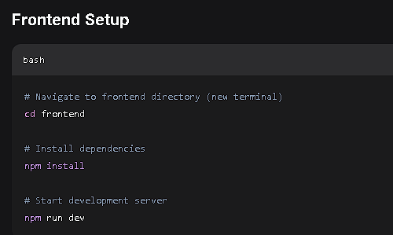

# Vibe Commerce - Full Stack E-commerce Cart Application

A complete full-stack shopping cart application built for the Vibe Commerce screening process. Features product browsing, cart management, and mock checkout functionality.

## 🚀 Live Demo

- **Frontend**: http://localhost:5173
- **Backend API**: http://localhost:5000

## 📋 Project Overview

This is a full-stack e-commerce application that demonstrates:
- Product catalog with real data from Fake Store API
- Shopping cart with add/remove/update functionality
- Checkout process with customer information
- Order confirmation with receipt generation
- Responsive design for all devices

## 🛠️ Tech Stack

### Frontend
- **React** - UI framework
- **Vite** - Build tool and dev server
- **Axios** - HTTP client for API calls
- **CSS3** - Styling with Grid and Flexbox

### Backend
- **Node.js** - Runtime environment
- **Express.js** - Web framework
- **SQLite** - Database for data persistence
- **Fake Store API** - External product data source

## 📁 Project Structure

e-com/
├── frontend/ # React application
│ ├── src/
│ │ ├── App.jsx # Main application component
│ │ ├── App.css # Application styles
│ │ └── main.jsx # Application entry point
│ ├── package.json
│ └── vite.config.js
├── backend/ # Node.js server
│ ├── server.js # Express server and API routes
│ └── package.json
└── README.md

## ⚡ Quick Start

### Prerequisites
- Node.js (v14 or higher)
- npm or yarn

### Backend Setup
```bash
# Navigate to backend directory
cd backend

# Install dependencies
npm install

# Start development server
npm run dev

